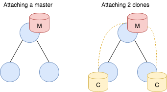

.. _data-stores:

Data Stores
===========

In addition to transmitting :ref:`data <data-model>` via publish/subscribe
communication, Broker also offers a mechanism to store this very data.
Data stores provide a distributed key-value interface that leverages the
existing :ref:`peer communication channels <communication>`.

Aspects
-------

A data store has two aspects: a *frontend* for interacting with the user, and a
*backend* that defines the database type for the key-value store.

Frontend
~~~~~~~~

Users interact with a data store through the frontend, which is either a
*master* or a *clone*. A master is authoritative for the store, whereas a clone
represents a local cache that is connected to the master. A clone cannot exist
without a master. Only the master can perform mutating operations on the store,
which it pushes out to all its clones. A clone has a full copy of the data for
faster access, but sends any modifying operations to its master first. Only
when the master propagates back the change, the result of the operation becomes
visible at the clone.

It is possible to attach one or more data stores to an endpoint, but each store
must have a unique master name. For example, two peers cannot both have a
master with the same name. When a clone connects to its master, it receives
a full dump of the store:

While the master can apply mutating operations to the store directly, clones
have to first send the operation to the master and wait for the replay for the
operation to take on effect:

.. figure:: _images/store-modify.png
  :align: center

Backend
~~~~~~~

The master can choose to keep its data in various backends:

1. **Memory**. This backend uses a hash-table to keep its data in memory. It is
   the fastest of all backends, but offers limited scalability and
   does not support persistence.

2. `SQLite <https://www.sqlite.org>`_. The SQLite backend stores its data in a
   SQLite3 format on disk. While offering persistence, it does not scale
   well to large volumes.

3. `RocksDB <http://rocksdb.org>`_. This backend relies on an
   industrial-strength, high-performance database with a variety of tuning
   knobs. If your application requires persistence and also needs to scale,
   this backend is your best choice.

Operations
----------

Key operations on data stores include attaching it to an endpoint, performing
mutating operations, and retrieving values at specific keys.

Construction
~~~~~~~~~~~~

The example below illustrates how to attach a master frontend with a memory
backend:

.. literalinclude:: _examples/stores.cc
   :start-after: --attach-master-start
   :end-before: --attach-master-end

The factory function ``endpoint::attach_master`` has the following signature:

.. code-block:: cpp

  expected<store> attach_master(std::string name, backend type,
                                backend_options opts=backend_options());

The function takes as first argument the global name of the store, as
second argument the type of store
(``broker::{memory,sqlite,rocksdb}``), and as third argument
optionally a set of backend options, such as the path where to keep
the backend on the filesystem. The function returns a
``expected<store>`` which encapsulates a type-erased reference to the
data store.

.. note::

  The type ``expected<T>`` encapsulates an instance of type ``T`` or a
  ``status``, with an interface that has "pointer semantics" for syntactic
  convenience:

  .. code-block:: cpp

    auto f(...) -> expected<T>;

    auto x = f();
    if (x)
      f(*x); // use instance of type T
    else
      std::cout << to_string(x.error()) << std::endl;

In the failure case, the ``expected<T>::error()`` holds an ``error``.

Modification
~~~~~~~~~~~~

Data stores support the following mutating operations:

``void put(data key, data value, optional<timespan> expiry = {}) const;``
    Stores the ``value`` at ``key``, overwriting a potentially previously
    existing value at that location. If ``expiry`` is given, the new
    entry will automatically be removed after that amount of time.

``void erase(data key) const;``
    Removes the value for the given key, if it exists.

``void clear() const;``
    Removes *all* current store values.

``void increment(data key, data amount, optional<timespan> expiry = {}) const;``
    Increments the existing value at ``key`` by the given amount. This
    is supported for numerical data types and for timestamps. If
    ``expiry`` is given, the modified entry's expiration time will be
    updated accordingly.

``void decrement(data key, data amount, optional<timespan> expiry = {}) const;``
    Decrements the existing value at ``key`` by the given amount. This
    is supported for numerical data types and for timestamps. If
    ``expiry`` is given, the modified entry's expiration time will be
    updated accordingly.

``void append(data key, data str, optional<timespan> expiry = {}) const;``
    Appends a new string ``str`` to an existing string value at
    ``key``. If ``expiry`` is given, the modified entry's expiration
    time will be updated accordingly.

``void insert_into(data key, data index, optional<timespan> expiry = {}) const;``
    For an existing set value stored at ``key``, inserts the value ``index``
    into it. If ``expiry`` is given, the modified entry's expiration
    time will be updated accordingly.

``void insert_into(data key, data index, data value, optional<timespan> expiry = {}) const;``
    For an existing vector or table value stored at ``key``, inserts
    ``value`` into it at ``index``. If ``expiry`` is given, the
    modified entry's expiration time will be updated accordingly.

``void remove_from(data key, data index, optional<timespan> expiry = {}) const;``
    For an existing vector, set or table value stored at ``key``,
    removes the value at ``index`` from it. If ``expiry`` is given,
    the modified entry's expiration time will be updated accordingly.

``void push(data key, data value, optional<timespan> expiry = {}) const;``
    For an existing vector at ``key``, appends ``value`` to its end. If
    ``expiry`` is given, the modified entry's expiration time will be
    updated accordingly.

``void pop(data key, optional<timespan> expiry = {}) const;``
    For an existing vector at ``key``, removes its last value. If
    ``expiry`` is given, the modified entry's expiration time will be
    updated accordingly.
    
Direct Retrieval
~~~~~~~~~~~~~~~~

Data stores support the following retrieval methods:

``expected<data> get(data key) const;``
    Retrieves the value at ``key``. If the key does not exist,
    returns an error ``ec::no_such_key``.

    .. literalinclude:: _examples/stores.cc
       :start-after: --get-with-error-start
       :end-before: --get-with-error-end

``expected<data> exists(data key) const;``
    Returns a ``boolean`` data value indicating whether ``key`` exists
    in the store.

``expected<data> get_index_from_value(data key, data index) const;``
  For containers values (sets, tables, vectors) at ``key``, retrieves
  a specific ``index`` from the value. For sets, the returned value is
  a ``boolean`` data instance indicating whether the index exists in
  the set. If ``key`` does not exist, returns an error
  ``ec::no_such_key``.

``expected<data> keys() const``
  Retrieves a copy of all the store's current keys, returned as a set.
  Note that this is a potentially expensive operation if the store is
  large.

All of these methods may return the ``ec::stale_data`` error when
querying a clone if it has yet to ever synchronize with its master or
if has been disconnected from its master for too long of a time period.
The length of time before a clone's cache is deemed stale depends on
an argument given to the ``endpoint::attach_clone`` method.

All these methods share the property that they will return the
corresponding result directly. Due to Broker's asynchronous operation
internally, this means that they may block for short amounts of time
until the result becomes available. If that's a problem, you can
receive results back asynchronously as well, see next section.

Note, however, that even with this direct interface, results may
sometimes take a bit to reflect operations that clients perform
(including the same client!). This effect is most pronounced when
working through a clone: any local manipulations will need to go
through the master before they become visible to the clone.

Proxy Retrieval
~~~~~~~~~~~~~~~

When integrating data store queries into an event loop, the direct
retrieval API may not prove a good fit: request and response are
coupled at lookup time, leading to potentially blocking operations.
Therefore, Broker offers a second mechanism to lookup values in data
stores. A ``store::proxy`` decouples lookup requests from responses
and exposes a *mailbox* to integrate into event loops. When a using a
proxy, each request receives a unique, monotonically increasing 64-bit
ID that is hauled through the response:

.. literalinclude:: _examples/stores.cc
   :start-after: --proxy-start
   :end-before: --proxy-end

The proxy provides the same set of retrieval methods as the direct
interface, with all of them returning the corresponding ID to retrieve
the result once it has come in.
